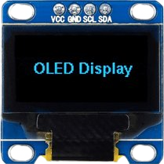
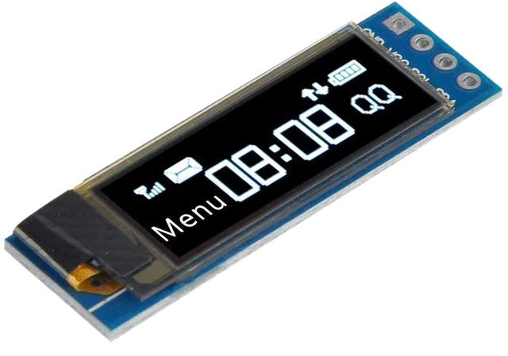

# Base Mbed OS driver for SSD1306 based OLED display

This library provides simple Mbed OS 6 driver for SSD1306 based OLED displays.

The driver only provides API to flush data from a buffer to a specified display region.

The interface should be drawn with some external libraries like [littelvgl](https://littlevgl.com/) and others.

Note: current implementation support only I2C displays.

TODO: add support of the SPI interface.

### Mbed OS version support

| Mbed OS | status |
|---|---|
| 6.2 | Compiles and runs ok |
